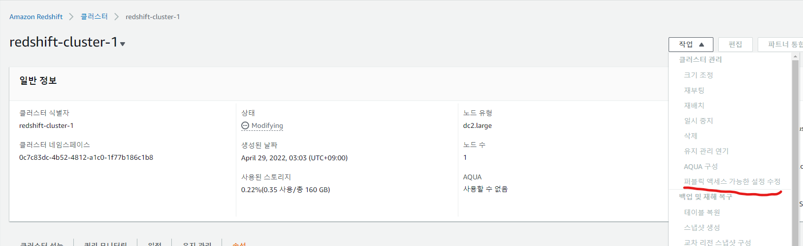

# Collect coin & twitter data in AWS


## 1. 프로젝트 개요

> #### Twitter에서 Bitcoin으로 태그 되는 게시물의 수와 Bitcoin의 거래량의 상관관계를 분석해본다.
>
> #### Aws kinesis를 통해 stream data를 처리해보고 redshift를 통해 DW를 구축해 Stream pipeline을 구성해본다.
>
> 1. EC2에서  coinone의 BTC 코인의 분봉 데이터와 Twitter api에서 bitcoin으로 태그된 데이터를 수집한다.
> 2. 실시간으로 수집된 데이터를 kinesis firehose를 통해 S3와 Redshift에 전달한다.
> 3. Data Studio를 통해 Dashboard를 만들고 분석한다.


## 2.  Twitter Streaming Data & Coin Streaming Data

#### 1) tweepy

https://docs.tweepy.org/ko/v3.9.0/getting_started.html

#### 2) twitter developer

https://developer.twitter.com/en

 


- developer를 통해 project와 key를 생성하고 tweepy API를 통해 트위터의 메세지를 실시간으로 수집
- bitcoin tag로 검색된 트윗 수집

#### 3)  Coin Streaming Data

https://coinone.co.kr/developer/

- api 키를 발급받고 BTC char를 1분마다 수집한다.

## 3. ec2

EC2를 생성하고 필요한 패키지를 설치한다.

```
sudo apt-get install openjdk-8-jdk
sudo apt install python
sudo apt-get install pip
sudo pip install boto3
sudo pip install tweepy==3.8.0
sudo apt-get install cron
```

cron 스케줄을 등록한다

```
* * * * * python3 /home/ubuntu/coinstream/main.py
```


## 4. Redshift

완전 관리형 DW

- 빠른 성능 (hive 대비 50~100배)
- 효율적인 비용
- 보안
- 데이터 레이크와의 통합 (S3에 대한 쿼리)

#### 1) 클러스터 생성

 

 

##### 2) Create table in query editor

 

 

- text  칼럼은 varchar 범위를 max로 설정해준다.

##### 3) 퍼블릭 엑세스 설정

- 엑세스 설정을 하지 않으면 ConnectionFailed error가 발생한다.

 

 


## 5. Kinesis Firehose

##### Stream Storage

- Stream Buffer 
  - 특정 Consumer가 데이터를 읽어도 큐에 데이터를 남겨둠, 다음 읽어 갈 위치만 표시
    - => 동일한 샤드에서 다른 Consumer가 데이터를 읽어갈수 있다.
    - 데이터 보관시간을 넘어가면 삭제 (re-tension)

##### 두개의 Delivery streams를 만들어 Twitter data와 coin data를 전송한다.

#### 1) Source and Destination

- Source -> Direct PUT

- Destination -> Redshift

- s3 COPY command options 

  - COPY option을 통해 s3에서 redshift table로 json형태의 copy가 가능하다.

  - s3에 2가지 json 파일을 업로드해준다. 

  - ./s3/jsonpath.json, ./s3/jsonpath2.json
  
    ```
    {
        "jsonpaths": [
            "$.id",
            "$.created_at",
            "$.text"
        ]
    }
    {
        "jsonpaths2": [
            "$.candle_date_time",
            "$.market",
            "$.opening_price",
            "$.closing_price",
            "$.low_price",
            "$.high_price",
            "$.target_volume",
            "$.timestamp"
        ]
    }
    ```

##### 2) Create a delivery stream

 

 


 

##### 3) monitoring

 

##### 4) check data in redshift

 

 


## 6. DataStudio

- Redshift데이터를 Datastudio와 연동해 Dashboard를 만든다. 

##### 1) 시간  분 별 수집된 Twitter 갯수, BTC 분봉의 거래량, 고가, 저가 시각화

